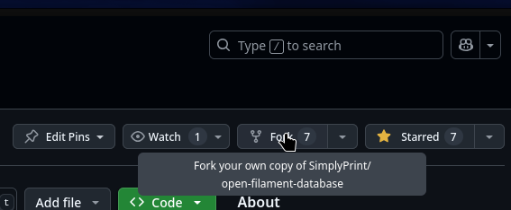

# Open Filament Database by SimplyPrint
The Open Filament Database, facilitated by SimplyPrint.

## ✅ Contributing: how to add to the database
The beautiful thing about the database is that it's open source so anyone can contribute, whether you're a hobbyist, print farm or brand.

The steps to contribute to the database are simple but may get technical at times depending on how you want to do it, don't worry if you don't all understand terms, we'll guide you through it.

### So what are the steps?
1. **Create a GitHub account**
2. **Create a copy of the database** (called "forking" this repository)
3. **Install a few small applications** (Git, Python, Node.js)
4. **Download your copy of the database** (called "cloning" it).
5. **Use either our simple web editor or use the manual method**
6. **Check if your data has errors**
7. **Upload your data and make what's called a pull request**

## Let's do it!

### 1. Sign up for a GitHub Account
If you don’t have one already, [create a free GitHub account](https://github.com/join).

### 2. Fork the Project (Two-Click)
Click the **Fork** button in the top right of this page, a guide is [available here if needed](docs/forking.md)

### 3. Install our requirements
If you don't have have Git, Python and Nodejs/NPM installed [follow this guide](docs/installing-software.md).
### 4. Download the database
Download the database using either [this guide](docs/cloning.md) or by just using the command below, with `YOUR_USERNAME` replaced ofc!
```bash
git clone https://github.com/YOUR_USERNAME/open-filament-database.git
cd open-filament-database
```
### 5. Make your changes!
Either use the web editor by simply running these commands or [following the guide](docs/webui.md), if you want to do it manually you can [use this one](docs/manual.md)
```bash
cd webui
npm install
npm run dev
```
and access it in your browser at http://localhost:5173

### 6. Validate your changes
Once you've finished modifying the database you can use these commands or [this guide](docs/validation.md) to make sure your data is correct, fix any errors that pop up
```bash
python data_validator.py --folder-names # Validates folder names.
python data_validator.py --json-files # Validates json files.
python data_validator.py --store-ids # Validates store ids.
```
### 7. Submit your changes
Start by running this command to add all your changes up
```bash
git add .
```
Then run this command but replace `COMMIT_MESSAGE` with a title of what you did, e.g. "Added filament A to brand B"
```bash
git commit -m "COMMIT_MESSAGE"
```
When that's done you can run this command to upload your stuff
```bash
git push -u origin main
```
Afterwards you can make a pull request [using this guide](docs/pull-requesting.md)
