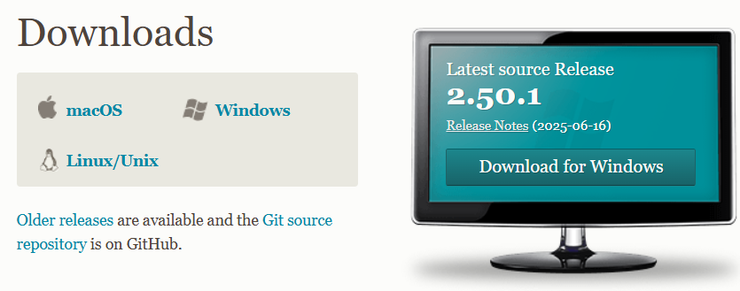
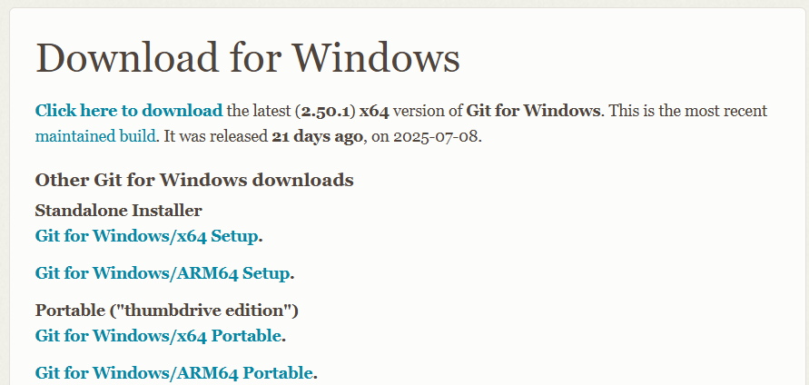
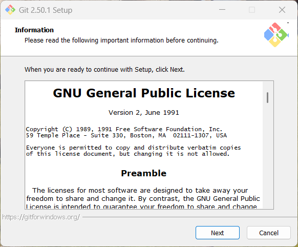
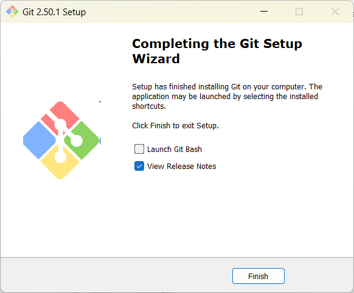
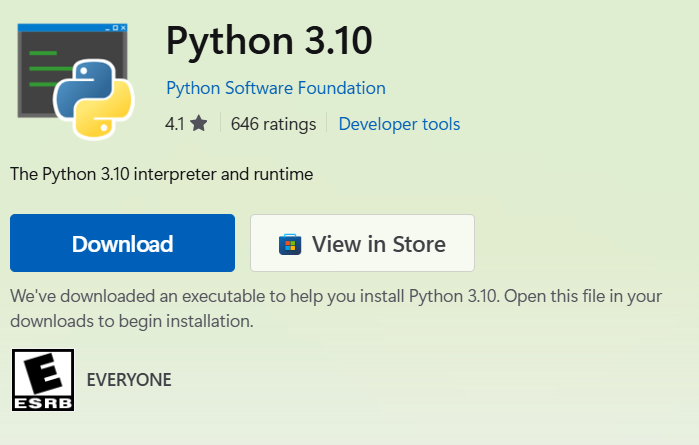
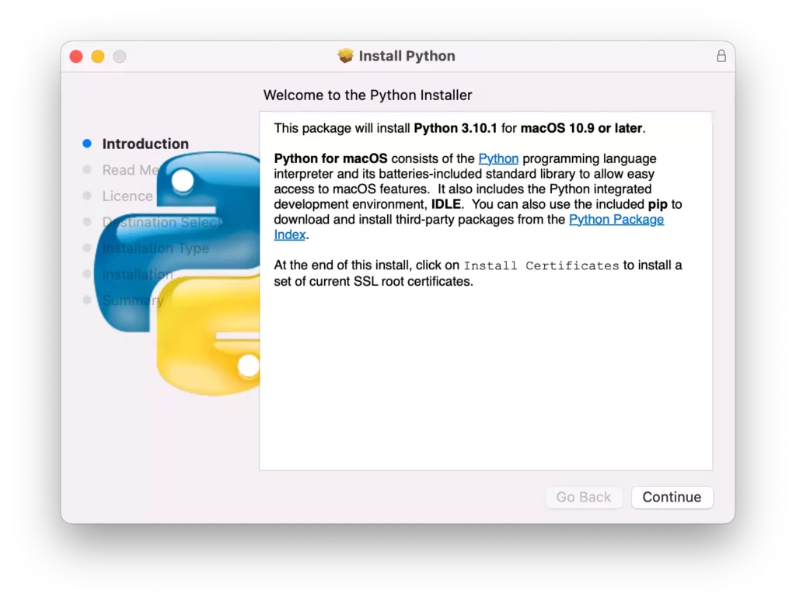
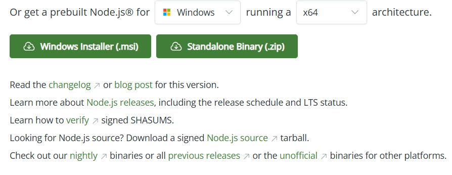
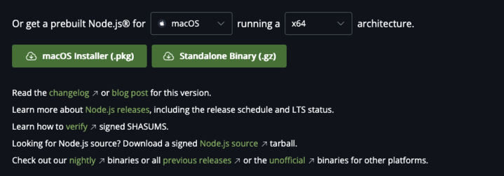

# What to install and how to do it
In this document we'll go through what we need to install and how to do it, depending on your computer
- [Git](#git)
- [python](#python)
- [NodeJS/NPM](#nodejsnpm)

## Git
### Windows
Go to https://git-scm.com/downloads and click the `Download for Windows` Button  
  
You'll most likely want to click on `Git for Windows/x64 Setup` on most systems as of writing  
  

Once the download is complete, click on the executable in the top right to start installing Git. Simply click through the setup wizard leaving all options on default.  
  
Once it's done installing we'd recommend you uncheck `View Release Notes` and click finish, this will close the installer without opening a text file with info about git  
  

### Linux

- **Fedora/RHEL**
    ```bash
    sudo dnf install git
    ```
- **Debian/Ubuntu**
    ```bash
    sudo apt install git
    ```
- **Arch**
    ```bash
    sudo pacman -Syu git
    ```

### Macos
Git *should* be preinstalled but in the case that it isn't we'd recommend installing it through [homebrew](https://brew.sh/) using the following command
```zsh
brew install git
```
If you don't have homebrew you can also use the [latest macOS Git Installer](https://sourceforge.net/projects/git-osx-installer/files/git-2.23.0-intel-universal-mavericks.dmg/download?use_mirror=autoselect)

## Python

### Windows
Go to https://apps.microsoft.com/detail/9pnrbtzxmb4z?ocid=webpdpshare and click the `View in Store` button  
  
Click `Open Microsoft Store` if prompted and click `Get`  
  

### Linux

- **Fedora/RHEL**
    ```bash
    sudo dnf install python
    ```
- **Debian/Ubuntu**
    ```bash
    sudo apt install python3
    # Optional or you'll have to replace python with python3 yourself in all commands
    sudo apt install python-is-python3
    ```
- **Arch**
    ```bash
    sudo pacman -Syu python
    ```

### Macos

#### Homebrew(recommended)
If you've got [homebrew](https://brew.sh/) installed you can simply run
```zsh
brew install python
```

#### Installer
Go to https://www.python.org/downloads/ and click the `Download Python` button  
  

Once the download is complete, double-click the package to start installing Python. The installer will walk you through a wizard to complete the installation, and in most cases, the default settings work well, so install it like the other applications on macOS. You may also have to enter your Mac password to let it know that you agree with installing Python.  
  

<sup>Mac Python instructions copied from https://www.dataquest.io/blog/installing-python-on-mac/</sup>

## NodeJS/NPM

### Windows
Go to https://nodejs.org/en/download/ and click the `Windows Installer (.msi)` button  
  

Once the download is complete, click on the executable in the top right to start installing Node. Wait a bit for it to load and then next, you'll have to check a box and after that just click through and wait for it to finish, then click `Close`  
  

### Linux

- **Fedora/RHEL**
    ```bash
    sudo dnf install nodejs npm
    ```
- **Debian/Ubuntu**
    ```bash
    sudo apt install nodejs npm
    ```
- **Arch**
    ```bash
    sudo pacman -Syu nodejs npm
    ```

### Macos

#### Homebrew(recommended)
If you've got [homebrew](https://brew.sh/) installed you can simply run
```zsh
brew install node
```

#### Installer
Go to https://nodejs.org/en/download and click the `macOS Installer (.pkg)` button near the bottom of the page  
  

Once the download is complete, double-click the package to start installing node. The installer will walk you through a wizard to complete the installation, and in most cases, the default settings work well, so install it like the other applications on macOS. You may also have to enter your Mac password to let it know that you agree with installing node.